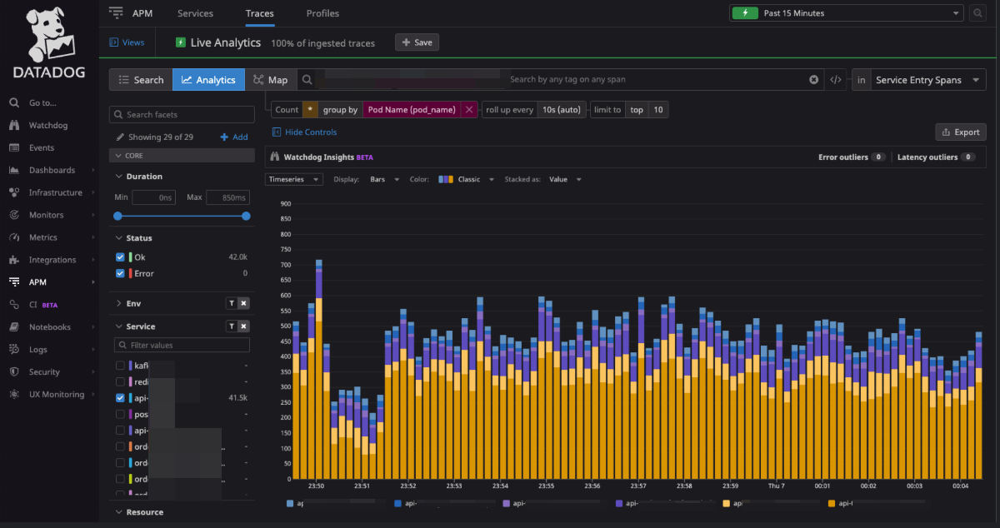

운영중인 서비스의 모니터링을 고도화하던 중 특정 파드에만 리소스가 몰리는 현상을 발견하여 그 이유와 해결 방법에 대한 리서치를 공유합니다.

<!--truncate-->

## 문제 인식


처음에 저 그래프를 봤던 순간을 기억합니다... 당연히 트래픽을 라운드 로빈 방식으로 분산하여 받고 있을 줄 알았는데... 쿠버네티스에게 배신을 당한 느낌입니다. _너... 이렇게 동작하고 있었던거니?_

이런 현상이 발생하고 있는 이유를 리서치하는 과정에서 [Load balancing and scaling long-lived connections in Kubernetes](https://learnk8s.io/kubernetes-long-lived-connections) 이라는 아주 잘 작성된 글을 발견하였습니다. 이미지와 상세한 설명으로 이유를 잘 알려주니 꼭 읽어볼 것을 추천드립니다.

이 글에서 간단하게 설명드리면, 쿠버네티스의 서비스에 IP 주소는 etcd 에 저장되고 저장된 IP 주소를 kube-proxy 에서 사용하는데, kube-proxy 는 iptables 을 사용합니다. iptables 는 로드 밸런싱을 하도록 설계되지 않았지만, 쿠버네티스는 스마트한 규칙 세트를 통해 비슷하게 작동하도록 하고 있습니다.


이러한 이유로 클라이언트에서 `Long-lived connections` 을 사용할 경우 쿠버네티스는 스케일 아웃을 하지 않습니다. 즉 keep-alive 헤더가 있는 HTTP request 는 TCP 연결을 유지하기 때문에 로드 밸런싱 되지 않는다는 것이죠. 그렇다고 keep-alive 를 사용하지 않도록 권고하는 것은 바람직하지 못합니다. 파이썬에서 `Connection: keep-alive` 을 사용하는 법을 설명한 [Learning about the HTTP “Connection: keep-alive” header](https://blog.insightdatascience.com/learning-about-the-http-connection-keep-alive-header-7ebe0efa209d) 글에 테스트 결과는 연결을 유지했을 때 이점을 잘 보여줍니다.

```text
Average time with keep-alive/persistent connections: 7.00 seconds
Average time with new connections: 22.38 seconds
```

## 해결 방법
그렇다면 어떻게 이 문제를 해결할 수 있을까요? 친절하게도 위에서 공유한 글에는 해결 방법까지 제안하고 있습니다. 글에서 제안하는 방법, 운영중인 서비스의 특성과 제 개인적인 생각까지 반영한 해결 방안은 아래와 같습니다.  

### 클라이언트 측 로직 개선
- 클라이언트에서 service 에 엔드포인트 목록을 가지고 와서 커넥션 풀을 만들고, 돌아가면서 요청해야 함
- 주기적으로 엔드포인트 업데이트도 포함
- 서비스 내부 클라이언트들은 로직을 개선하여 해결할 수 있지만 API 를 사용하는 고객들에게 로직 개선을 기대하는 것은 무리

### 클라이언트 갯수 증가
- 웹 접근 요청은 엔진엑스를 통하여 프록시되고 있기 때문에 엔진엑스와 특정 파드에 영구 커넥션이 열려서 웹앱으로 접근하는 모든 요청이 단일 파드에 몰리는 현상이 있을 것으로 추정
- 웹 클라이언트를 늘려서 영구 연결을 맺는 여는 클라이언트를 늘려서 분산 가능

### 서비스 메시 적용
- 각 서비스에 변경없이 가장 우아하게 문제를 해결할 수 있는 방법이라고 생각
- 러닝 커브 및 변경 범위가 너무 넓음, 단기적으로 해결할 수 없음
- 서비스 메시 도구 중 istio 가 가장 유력

### Application API Gateway 도입 
- Application API Gateway 가 로드 밸런싱
- API 게이트웨이 자체적으로 같은 이슈를 겪게 될 가능성이 있으나, 서비스 로직을 수행하는 주체가 아니기 때문에 부하로 인한 문제 해소에는 도움이 될 것으로 예상

아무래도 서비스 메시 적용을 하는 방법으로 해결할 가능성이 가장 커보입니다. `istio`는 이전에도 도입을 검토했었고 학습도 어느 정도는 진행된 상태입니다. 장기적으로 봤을 때도 가장 효과적인 해결 방법이라고 생각합니다. 하지만 제대로 공부하고 쓰지 않는다면 이슈가 쿠버에서 istio 로 옮겨갈 가능성도 있고, 또 관리 포인트도 늘어나는 점은 감안해야 합니다. 

## 마치며
쿠버네티스를 사용한지 꽤나 오래되었음에도 내부적으로 어떻게 동작하는지 확실히 학습하지 못한 부분에 깊이 반성하고 있습니다. 물론 이 이슈 뿐아니라 무지로 인해 지금도 최적화되어 동작하지 않는 부분이 존재할 것으로 예상됩니다. 끊임없는 학습에 필요성을 다시 한번 체감합니다. 조만간 이 이슈를 해결한 뒤 트래픽이 모든 파드에 우아하게 분산된 그래프를 공유해보도록 하겠습니다.