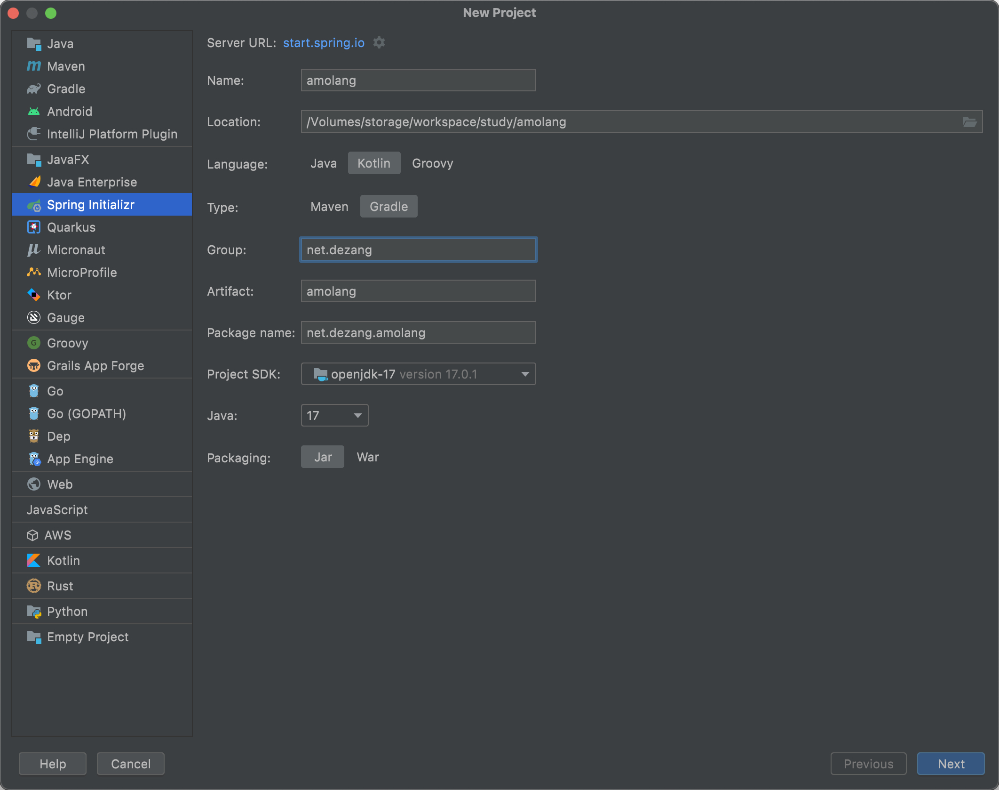
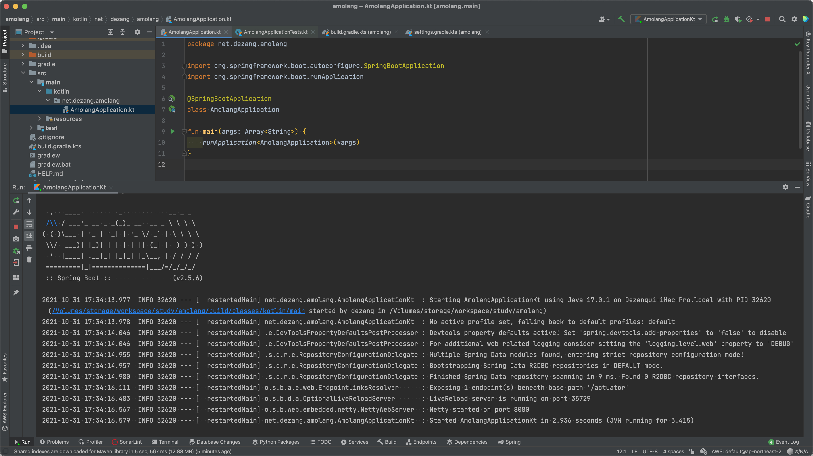

배우고 싶은 기술들을 학습하고 사용하려고 하려다보니, 자꾸 미루게 됩니다. '아몰랑, 그냥 쓰고 싶은거 다 때려박고 이슈 해결해가면서 써보자' 라는 생각으로 `아몰랑` 프로젝트를 시작해보려합니다. 무엇을 만들거냐구요? **아몰랑!**  

<!--truncate-->

## 시작
최근에 GoLang 이나 Rust 학습에 대한 관심이 있었지만, 그건 제가 밥 벌어먹고 사용하고 있는 자바에 대한 전문성을 더 키우고 난 뒤라는 핑계로 계속 미루고 있었습니다. 그리고 최근 스스로에게 다시 물었죠. 

> 그럼 코틀린은 어때? JVM 언어에다가 최근에 멀티 플랫폼이나 웹 지원이나 핫하던데?

음... 딱히 핑계거리가 없네요. 차후 안드로이드 개발할 때도 코틀린을 사용해야하고, 스프링도 코틀린을 잘 지원해주는 것 같아보이니까요. 무언가 새로운 기술을 사용하기 위해서 처음 방문해야 할 곳은 그 기술에 공식 홈페이지와 레퍼런스 페이지입니다. 바로 https://kotlinlang.org 에 들어가보았지만, 음... 어디서부터 시작할지 모르겠네요. [Create a RESTful web service with a database using Spring Boot – tutorial](https://kotlinlang.org/docs/jvm-spring-boot-restful.html) 가 시작하기 가장 좋은 문서같아 보이긴 하는데... 일단 그냥 만들어봅시다. 스프링으로 시작하는게 좋을 것 같아요.

## 욕심
[Spring Initializr](https://start.spring.io/) 에 들어가보니 자바17도 선택할 수 있게 되어있네요. [2021년 9월에 자바 17 LTS 를 공식적으로 발표](https://www.oracle.com/kr/news/announcement/oracle-releases-java-17-2021-09-14/) 했습니다. 아직 자바 11도 제대로 쓰지 못하고 있긴 하지만, 이왕 공부할겸 시작하는거 17로 시작해보죠. 호환성 지원 범위는 어떻고, 어떤 기능들이 추가되고 변경되었냐구요? 아몰랑.. 그냥 쓸래.. 어짜피 개인 프로젝트인데 뭐.



음... 사용할 라이브러리를 고르다보니, Spring Reactive Web 이 딱 보이네요. 그래 webflux 를 계속 무시할 수는 없지, 실무 적용 사례도 많이 보이고... 이렇게 쓰고 싶은 라이브러리들을 하나 둘 담다보니... 아래처럼 되어버렸습니다. 

```groovy
dependencies {
    implementation("org.springframework.boot:spring-boot-starter-actuator")
    implementation("org.springframework.boot:spring-boot-starter-data-jpa")
    implementation("org.springframework.boot:spring-boot-starter-data-r2dbc")
    implementation("org.springframework.boot:spring-boot-starter-rsocket")
    implementation("org.springframework.boot:spring-boot-starter-webflux")
    implementation("com.fasterxml.jackson.module:jackson-module-kotlin")
    implementation("io.projectreactor.kotlin:reactor-kotlin-extensions")
    implementation("org.jetbrains.kotlin:kotlin-reflect")
    implementation("org.jetbrains.kotlin:kotlin-stdlib-jdk8")
    implementation("org.jetbrains.kotlinx:kotlinx-coroutines-reactor")
    compileOnly("org.projectlombok:lombok")
    developmentOnly("org.springframework.boot:spring-boot-devtools")
    runtimeOnly("com.h2database:h2")
    runtimeOnly("dev.miku:r2dbc-mysql")
    runtimeOnly("io.micrometer:micrometer-registry-prometheus")
    runtimeOnly("io.r2dbc:r2dbc-h2")
    runtimeOnly("mysql:mysql-connector-java")
    annotationProcessor("org.springframework.boot:spring-boot-configuration-processor")
    annotationProcessor("org.projectlombok:lombok")
    testImplementation("org.springframework.boot:spring-boot-starter-test")
    testImplementation("io.projectreactor:reactor-test")
    testImplementation("org.springframework.restdocs:spring-restdocs-webtestclient")
}
```

데이터베이스 접근도 비동기로 하고 싶고, RSOCKET 도 써보고 싶고... JPA는 당연히 사용해야 하고... 그래도 시큐리티랑 이것저것은 뺀 것이긴 한데... 아몰랑 일단 다 넣고 실행해보자! 

...
## 실행
하지만 그래들 빌드부터 실패하였습니다. 역시 시작부터 쉽지 않네요. 하지만 구글링해서 살짝 수정해주니 빌드가 되었습니드아앗.

- [snippetsDir and the kotlin dsl](https://github.com/spring-io/initializr/issues/922) 을 참고하여 `build.gradle.kts` 수정
- asciidoctor 무지성 주석처리... _(빨리 실행하고 싶다고!)_

그리고 아무것도 건들지 않은 녀석을 실행하였더니...



무사히 실행되었습니다! 부트야 대단하다 너...

## 마치며
실행되는 프로젝트를 가지고 있으니 반은 왔다고 생각해도 될까요?... 이제 간단한 샘플 API 를 만들어봐야겠어요. 데이터베이스 사용도 해보고 말이죠. 아, 자바17은 저에게 어떤 고난과 시련을 안겨다 줄까요? 역시 새로운 것을 시작하는 것은 저를 항상 두근거리게 만듭니다. 프로젝트 이름도 고민하고 싶지 않아서 만든 "[아몰랑 프로젝트](https://github.com/dezang/amolang)". 이것저것 개발하면서 이슈를 해결하면서 "이제알앙 프로젝트" 로 프로젝트 이름을 변경할 그 날을 상상하며 글 마치겠습니다.