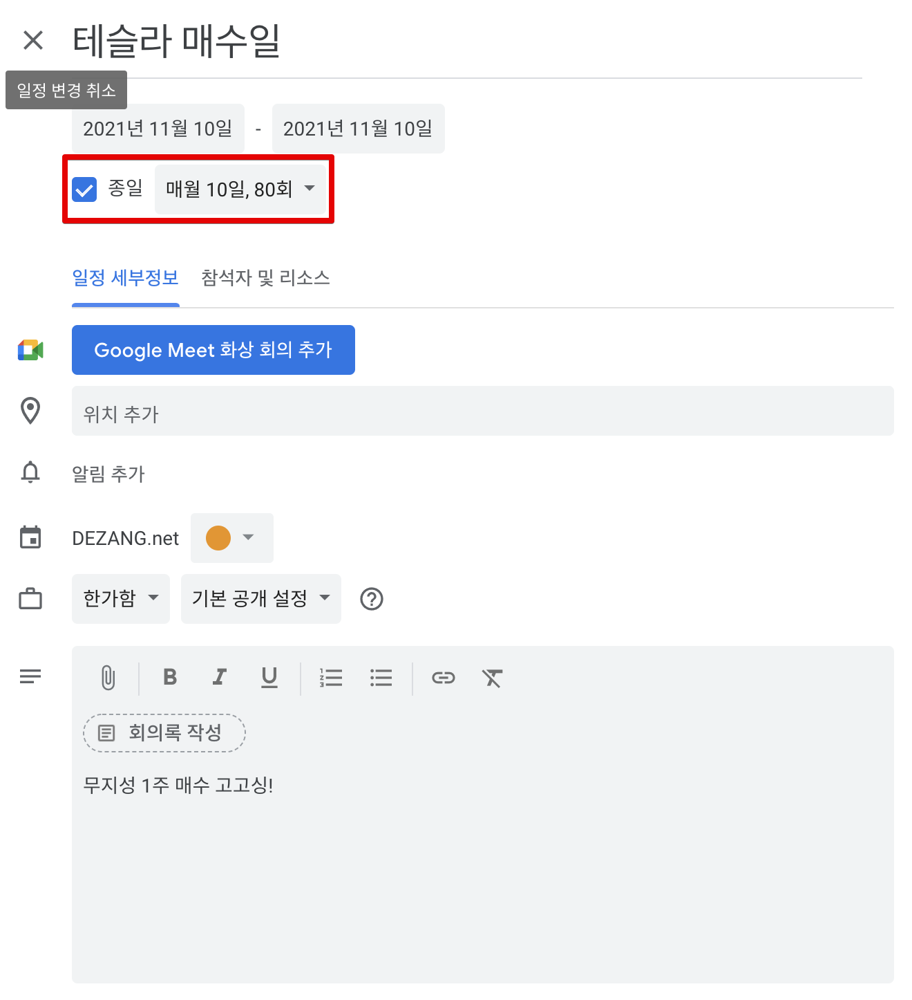

시장신(MarketGod) 은 제가 팔기만을 기다렸던걸까요. 테슬라 주가가 $1100 를 훌쩍 넘겨버렸습니다. 엄청 달리고 있는 테슬라에 올라타기 위한 제 자신과 약속을 해보려합니다.

<!--truncate-->

---

## 회상
이전에 작성한 [해외 포트폴리오 공개글](https://dezang.net/blog/2021/09/12/sharing-portfolio#%EC%95%9E%EC%9C%BC%EB%A1%9C%EC%9D%98-%EA%B3%84%ED%9A%8D) 에서 저는 아래와 같은 계획을 공유했었습니다... _(이 때 $736 였네요...)_

> 제가 보기에도 다른 기업들의 현재 영업이익이나 미래 가치에 비해서 고평가되어 있다고 생각합니다만, 그래도 테슬라 100주는 보유하려고 합니다. 그래야 후회하지 않을 것 같아요. 설사 다시 500달러, 혹은 더 깊은 나락으로 떨어지더라도 말이죠. 그렇게 떨어지면 더 사면 되구요!

그리고 지난 주에 [테슬라 주식을 팔았습니다...](https://dezang.net/blog/2021/10/24/i-sold-my-tesla-stock) 글에서는 이렇게 적기도 했죠.

> 제가 팔았던 금액 $868 은 다시는 오지 않을 금액일지도 모릅니다. 하지만 이 가격에서도 수익률은 30% 이상이였고, 제 선택에 후회는 없습니다. 너무 큰 욕심은 화를 부른다고 믿으니까요.

저 글을 작성한지 일주일 밖에 안 지났지만... 후회합니다. 왜 테슬라를 팔았을까요. 무조건 100주를 보유하겠다는 그 때 다짐을 왜 잊어버렸을까요? 너무 급상승했으니 빠지면 다시 들어가겠다는 저의 전략은 너무나도 허접했습니다...

문제는 $868 에 팔고나니 지금 가격에 매수버튼에 손이 안 나간다는거죠... 목표 보유 수량인 100주에 한걸음씩이라도 다가가야 할 텐데 말이죠. 어떻게 하면 좋을까 고민하다가 아래와 같이 행동하기로 했습니다.

## 약속
약속은 간단합니다. "한 달에 테슬라 한 주 담기" 입니다. 그게 역사적 최고점이여도 말이죠. 더 명확히 행동할 수 있도록 약속에 디테일을 추가해보겠습니다.

- 매월 10일 테슬라 1주를 시장가로 매수한다. 10일이 장이 열리지 않는 날이라면 직전 영업일에 매수한다.
- 매수 시각은 되도록 장오픈 30분 이내로 한다. (고민하지말고 매수 후 딥슬립!)
- 테슬라 매수일 외에 매수 수량은 약속 수량에 포함하지 않는다. 즉 10일 이전에 테슬라 한 주를 샀다하더라도, 10일 당일 테슬라 한 주는 반드시 매수하여야 한다.
- 매도는 100주를 달성하고 난 이후에 고민한다.

## 마치며
간단히 말해서 가격에 흔들리지 않겠다는 제 자신과의 약속입니다 한 달에 한 개씩 담으려면 일을 더 열심히 해야겠습니다.ㅠ 80개 더 담아야하니 저 약속대로만 하면 100주까지 6년이 넘게 걸리네요. 목돈 생기면 가끔 더 담아야겠어요.  